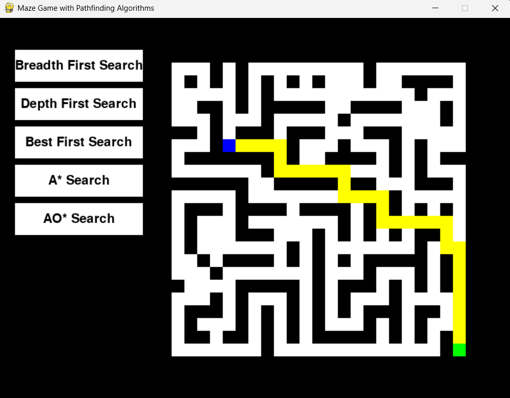

# Maze Pathfinding

A simple and educational maze-based project that demonstrates and visualizes popular pathfinding algorithms. It helps in understanding how different search techniques explore paths to find a solution efficiently.



## 🚀 Features

- Interactive maze environment
- Visualization of path exploration
- Comparison of multiple search algorithms
- Highlights shortest path and traversal patterns

## 🔍 Algorithms Implemented

1. **Breadth-First Search (BFS)**
2. **Depth-First Search (DFS)**
3. **Best-First Search**
4. **A\* Search**
5. **AO\* Search**

## 📦 Installation & Running

1. **Clone the repository**

```bash
git clone https://github.com/TUSHAR-S-KALE/pathfinding-algorithms.git
```

2. **Navigate to project directory**

```bash
cd pathfinding-algorithms
```

3. **Install dependencies**

```bash
pip install -r requirements.txt
```

4. **Run the application**
```bash
python maze.py
```

## 📊 Visualization

- Real-time path exploration

- Different colors for visited nodes and final solution path

- Helps compare algorithm efficiency and behavior


## 📚 Learning Outcomes

- Understanding various search strategies

- Difference between uninformed and informed search

- Practical exposure to heuristic-based approaches


## 📄 License

This project is licensed under the MIT License.